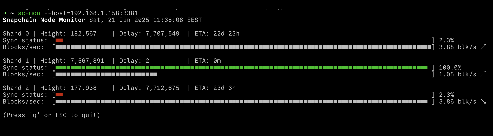

# sc-mon
Snapchain node monitor



## Install

- Binaries: [pre-built binaries](https://github.com/vrypan/sc-mon/releases)
- From source: Clone the repo, and run `make`. Copy the generated binaries `sc-mon` to a location in your $PATH.
- macOS/Homebrew:
  ```
  brew install vrypan/sc-mon/sc-mon
  ```

## Use

```
sc-mon --host=192.168.1.10:3381
```

Sample output

```
Snapchain Node Monitor Sat, 21 Jun 2025 11:19:25 EEST

Shard 0 | Height: 178,027    | Delay: 7,711,448  | ETA: 23d 3h
Sync status: [■■                                                                                                  ] 2.3%
Blocks/sec:  [■■■■■■■■■■■■■■■■■■■■■■■■■■■■■■■■■■■■■■■■■■■■■■■■■■■■■■■■■■■■■■■■■■■■■■■■■■■■■■■■■■■■■■■■■■■■■■■■■■■■] 3.86 blk/s ↗

Shard 1 | Height: 7,566,766  | Delay: 6          | ETA: 0m
Sync status: [■■■■■■■■■■■■■■■■■■■■■■■■■■■■■■■■■■■■■■■■■■■■■■■■■■■■■■■■■■■■■■■■■■■■■■■■■■■■■■■■■■■■■■■■■■■■■■■■■■■ ] 100.0%
Blocks/sec:  [■■■■■■■■■■■■■■■■■■■■■■■■                                                                            ] 0.95 blk/s ↘

Shard 2 | Height: 173,402    | Delay: 7,716,569  | ETA: 23d 3h
Sync status: [■■                                                                                                  ] 2.2%
Blocks/sec:  [■■■■■■■■■■■■■■■■■■■■■■■■■■■■■■■■■■■■■■■■■■■■■■■■■■■■■■■■■■■■■■■■■■■■■■■■■■■■■■■■■■■■■■■■■■■■■■■■■■■■] 3.86 blk/s ↗

```

Use `sc-mon --help` to see all options.
